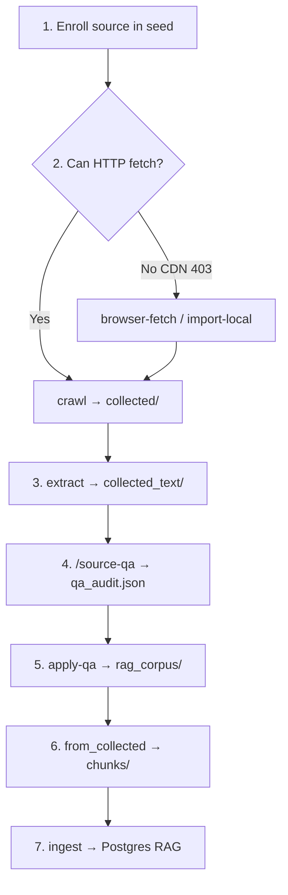
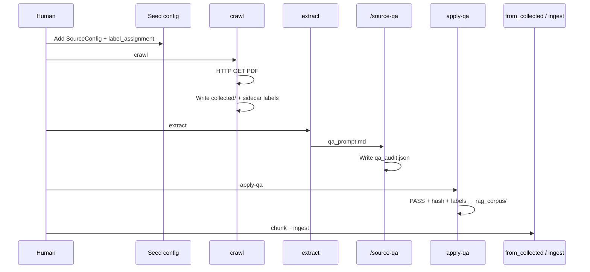
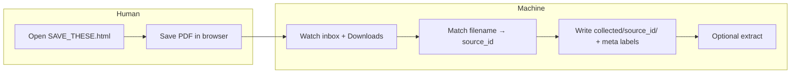
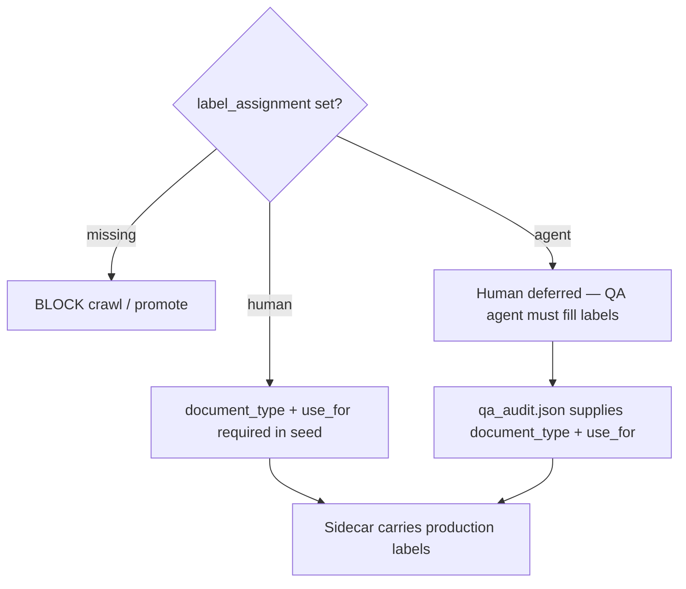
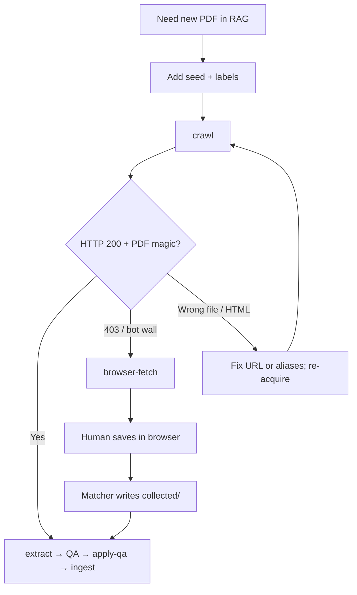

# Source Acquisition Pipeline — Operator Guide

**Audience:** humans adding PRA / methodology (and similar) documents into the RAG corpus  
**Packages:** `source_crawler` → `source_ingest`  
**Label vocab:** [`docs/knowledge/rag_label_vocab.md`](../knowledge/rag_label_vocab.md)  
**Module architecture:** [`source_crawler.md`](source_crawler.md)

This document describes the **end-to-end process** we use to acquire sources, label them, QA them, promote them into the corpus layout, chunk them, and ingest them into Postgres RAG. It covers both **fully automatic HTTP crawl** and **semi-automatic browser download** (when a CDN blocks scripts).

---

## Goals

1. Land every source under a stable `source_id` with correct metadata.
2. Force a **human acknowledgment** of RAG labels (`human` or deferred `agent`) before promote.
3. Keep agents from inventing production labels from text snippets alone.
4. Gate promote on QA (`PASS` + hash match + resolved labels).
5. Store promoted files in a professional layout: `artifacts/rag_corpus/{document_type}/tier_{n}/{domain}/`.

---

## Artifact layout

| Path | Role |
|------|------|
| `artifacts/collected/<source_id>/` | Bronze raw download (PDF + `.meta.json`) |
| `artifacts/download_inbox/` | Semi-auto drop zone + `SAVE_THESE.html` |
| `artifacts/collected_text/<source_id>/` | Extracted text, `qa_pack.json` |
| `artifacts/collected_text/qa_prompt.md` | Packs that need QA |
| `artifacts/collected_text/qa_audit.json` | Agent QA audit (machine-readable) |
| `artifacts/rag_corpus/{document_type}/tier_{n}/{domain}/` | Promoted KB inputs for ingest |
| `artifacts/chunks/<source_id>/` | Chunk JSONL + manifest |
| Postgres (`rag_adhoc`) | Embeddings + filterable events |

Legacy name `artifacts/oil_rag_sources/` is superseded by `artifacts/rag_corpus/`.

---

## End-to-end flow



### Stage summary

| Step | Who | Command / action | Output |
|------|-----|------------------|--------|
| Enroll | Human | Edit seed (`SourceConfig` + labels) | Catalog entry |
| Acquire | Machine (+ human if blocked) | `crawl` or `browser-fetch` | `collected/` |
| Extract | Machine | `extract` | `collected_text/`, `qa_prompt.md` |
| QA | Agent (`/source-qa`) | Review packs only | `qa_audit.json` |
| Promote | Machine | `apply-qa` | `rag_corpus/` |
| Chunk | Machine | `from_collected` | `artifacts/chunks/` |
| Ingest | Machine | `from_collected --ingest` or `source_ingest.ingest` | DB events |

---

## Path A — Automatic HTTP crawl

Use when the publisher serves PDFs without bot blocking (example: Argus).

```bash
# After seed entry exists with labels:
uv run python -m source_crawler crawl --source-id <source_id>
# or crawl entire seed:
uv run python -m source_crawler crawl

uv run python -m source_crawler extract
# /source-qa in Cursor Agent
uv run python -m source_crawler apply-qa --dry-run
uv run python -m source_crawler apply-qa
uv run python -m source_ingest.from_collected --sources-dir artifacts/rag_corpus
# then ingest into the target tenant DB (local or via SSH tunnel)
```



**Behavior notes**

- Unchanged PDFs still **sync sidecars** (labels from seed).
- One failed URL no longer aborts the whole seed (`failed` status + logs).
- Exit code `1` if any source `failed`.

---

## Path B — Semi-automatic browser download

Use when HTTP returns **403** (Akamai / bot protection), e.g. S&P Platts CDN.  
The browser passes the challenge; the pipeline still owns placement, labels, QA, and ingest.

### What you do (minimum)

1. Run `browser-fetch` (opens a save guide, watches folders).
2. For each link: open PDF in the browser → **Save**.
3. Stop when the CLI reports all targets imported (or run `import-local` once).

You do **not** rename into `collected/` by hand and you do **not** write sidecars by hand.

### Commands

```bash
# Opens artifacts/download_inbox/SAVE_THESE.html
# Watches inbox + ~/Downloads (default 15 minutes)
uv run python -m source_crawler browser-fetch --extract

# If files are already in Downloads / inbox:
uv run python -m source_crawler import-local
```



### Filename matching

Browsers often save **Content-Disposition** names that differ from the URL basename  
(e.g. `america-crude-specifications.pdf` vs `americas-crude-methodology.pdf`).

Matching uses, in order of robustness:

1. Exact / normalized aliases from `SourceConfig.extras["download_aliases"]`
2. URL basename and `source_id.pdf`
3. Canonical token synonyms (`america`↔`americas`, `apac`↔`apag`, `specifications`↔`methodology`, …)

Ambiguous matches are **rejected** (no silent wrong placement).  
Imported files are moved to `download_inbox/.imported/` (or left if `--keep`).

**Tip:** When adding a new CDN-blocked source, after the first successful browser save, add that real filename to `download_aliases` in the seed.

---

## Enrolling a new source (checklist)

Do this **before** crawl / browser-fetch.

### 1. Add a seed entry

File pattern: `source_crawler/seeds/<seed_name>.py`  
Current methodology catalog: `source_crawler/seeds/pricing_methodology.py`

Required fields:

| Field | Required | Notes |
|-------|----------|--------|
| `source_id` | yes | Stable slug; becomes folder name |
| `adapter` | yes | Usually `static_pdf` |
| `endpoint` | yes | Canonical publisher URL |
| `title`, `publisher` | recommended | Used in chunk prefixes |
| `tier`, `domain`, `commodity`, `region`, `tags` | recommended | Filters / entities |
| `label_assignment` | **yes** | `human` or `agent` |
| `document_type`, `use_for` | if `human` | From controlled vocab |
| `extras.download_aliases` | recommended for CDN sources | Real browser filenames |

Example (`human` labels — preferred when you know the role):

```python
SourceConfig(
    source_id="platts_emea_crude_methodology",
    adapter="static_pdf",
    endpoint="https://…/emea-crude-methodology.pdf",
    title="Platts Europe and Africa Crude Oil Specifications Guide",
    publisher="S&P Global Commodity Insights",
    tier=1,
    domain="trading_mechanics",
    region="europe_africa",
    tags=("methodology", "pricing", "pra", "platts", "crude", "emea"),
    label_assignment="human",
    document_type="methodology",
    use_for=("pricing_context",),
    extras={"download_aliases": ["emea-crude-specifications.pdf"]},
)
```

### 2. Label gate (do not skip)



- Vocab is closed: [`rag_label_vocab.md`](../knowledge/rag_label_vocab.md).
- New label values need a vocab update **and** a retrieval consumer — not free-form tags.
- Free-form `tags` are OK for ranking/explanation; they are **not** the promote/retrieval gate.

### 3. Acquire

```bash
uv run python -m source_crawler crawl --source-id <id>
# if failed with HTTP 403:
uv run python -m source_crawler browser-fetch --source-id <id> --extract
```

### 4. QA → promote → RAG

```bash
uv run python -m source_crawler extract
# Cursor: /source-qa
uv run python -m source_crawler apply-qa --dry-run
uv run python -m source_crawler apply-qa
uv run python -m source_ingest.from_collected --sources-dir artifacts/rag_corpus
# ingest with tenant DB credentials as in your env / tunnel runbook
```

`/source-qa` rules (also in `.cursor/commands/source-qa.md`):

- Review **only** packs listed in `qa_prompt.md`.
- `label_assignment=human` → **copy** `document_type` / `use_for` from the pack.
- `label_assignment=agent` → set labels from vocab.
- `safe_to_promote` only for `verdict: PASS`.
- Do not promote/ingest inside the QA command.

---

## Promote layout and RAG filters

Promoted path:

```text
artifacts/rag_corpus/
  methodology/
    tier_1/
      trading_mechanics/
        <source_id>.pdf
        <source_id>.pdf.meta.json
```

Sidecar / chunk filters carry:

| Field | Typical methodology value | Consumed as |
|-------|---------------------------|-------------|
| `document_type` | `methodology` | chunk filter + entities |
| `use_for` | `["pricing_context"]` | chunk filter + entities |
| `domain` → `category` | `trading_mechanics` | `Event.category` |
| `commodity` | `crude_oil` | `Event.commodity` |
| `region` | e.g. `americas` | `Event.region` |
| `tier`, `tags`, URL | — | `Event.entities` |

Downstream retrieval should filter by `use_for` / `document_type` so methodology chunks do not mix into playbook or education queries.

---

## Decision tree: which acquire path?



---

## Operational tips

| Situation | What to do |
|-----------|------------|
| Crawl fails one URL, others OK | Continue; only failed IDs need browser-fetch |
| Watch loop never imports | Check real filename in `~/Downloads`; add `download_aliases`; run `import-local` |
| Re-run after label change | `crawl` (sync sidecar) or `import-local` then `extract` + QA if hashes change |
| Re-QA only FAIL / new hashes | `packs_needing_qa` skips current PASS with matching `source_sha256` |
| Manual override promote | `promote --source-id …` (exception path; normal path is `apply-qa`) |
| Ingest to VPS | Chunk locally, ingest with tunnel + tenant id (same as existing ingest runbook) |

---

## Worked example — pricing methodology seed

Catalog: `source_crawler/seeds/pricing_methodology.py`

| Publisher | Acquire path | Result |
|-----------|--------------|--------|
| Argus (4 guides) | Automatic `crawl` | `collected/` + labels |
| Platts (5 guides) | Semi-auto `browser-fetch` / `import-local` (Akamai 403) | Same layout |

Shared labels for this seed: `document_type=methodology`, `use_for=["pricing_context"]`, `label_assignment=human`.

Pipeline after acquire:

```text
extract → /source-qa → apply-qa → rag_corpus/methodology/tier_1/trading_mechanics/
       → from_collected → chunks → ingest (Postgres)
```

---

## Related commands (cheat sheet)

```bash
# Auto
uv run python -m source_crawler crawl
uv run python -m source_crawler extract

# Semi-auto
uv run python -m source_crawler browser-fetch --extract
uv run python -m source_crawler import-local

# Gate + corpus
# /source-qa
uv run python -m source_crawler apply-qa --dry-run
uv run python -m source_crawler apply-qa

# Chunk (+ optional ingest)
uv run python -m source_ingest.from_collected --sources-dir artifacts/rag_corpus
uv run python -m source_ingest.from_collected --sources-dir artifacts/rag_corpus \
  --ingest --tenant-id '<TENANT_UUID>'
```

Tests: `uv run pytest tests/source_crawler/ -q`
