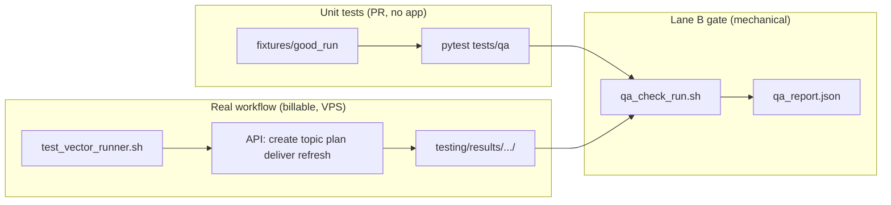

# testing/

Stable evaluation harness (#11). Full cold run: plan → deliver → refresh. Fresh topic every time (no cache).

Spec: `docs/specs/done/rag_full_stable_evaluation_11.md`

## How to run

**Prereq:** `testing/.env.test1` (or `.env.test2` / `.env.testing` for prod) with `API`, `CLAUDE_AGENT_API_KEY`. Needs `curl`, `jq`, `bc`. Prod/test URLs must be **HTTPS hostnames** (not `IP:8002` — ports are localhost-only on the VPS).

```bash
# From repo root — full run (~15–30 min)
scripts/test_vector_runner.sh --env test1

# Other slot or prod
scripts/test_vector_runner.sh --env test2
scripts/test_vector_runner.sh --env prod

# After crash — continue same run
scripts/test_vector_runner.sh --env test1 --resume

# Compare two finished runs
scripts/compare_evaluations.sh \
  testing/results/test1/latest/evaluation.json \
  testing/results/test2/latest/evaluation.json
```

**Results:** `testing/results/<env>/<timestamp>/` — `evaluation.json`, `qa_report.json`, `agent_log/`, `business_output/`, `runner.log`. Latest: `testing/results/<env>/latest/`.

## Environments

| Env | URL | Config |
|---|---|---|
| `test1` | `agent-test1.particletico.com` | `testing/.env.test1` |
| `test2` | `agent-test2.particletico.com` | `testing/.env.test2` |
| `prod` | `agent.particletico.com` | `testing/.env.testing` |

## Test Vector

Current vector (`testing/vectors.json`):

| ID | Topic | Stages |
|---|---|---|
| V001_hormuz | Hormuz strait closure options to lower price | plan → deliver → refresh |

Exercises the entire lifecycle: topic creation, query planning with intro, delivery with report, and refresh with latest news delta.

## Two-Channel Output

| Channel | Directory | Content |
|---|---|---|
| **Agent debug log** | `agent_log/` | Complete SSE events, tool calls, stage timing, costs, errors — system internals |
| **Business output** | `business_output/` | intro.md, report.md, news.json, parsed.json — what the user sees |

Plus:
- `evaluation.json` — 40+ structured metrics extracted from both channels
- `runner.log` — timestamped run log
- `state.json` — recovery checkpoint

## Output Layout

```
testing/results/<env>/<timestamp>/
  state.json                ← checkpoint for recovery
  runner.log                ← human-readable run log
  evaluation.json           ← structured metrics for comparison
  agent_log/
    create_response.json    ← POST /topics response
    events_plan.ndjson      ← SSE events during planning
    events_deliver.ndjson   ← SSE events during delivery
    events_refresh_1.ndjson ← SSE events during refresh
    events_full.ndjson      ← complete event log from DB (authoritative)
    topic_final.json        ← final topic state
  business_output/
    parsed.json             ← query plan (search strategy)
    intro.md / intro.json   ← working thesis and intro
    news.json               ← collected sources with scores
    report.json             ← structured report (findings, scenarios)
    report.md               ← markdown report (what user reads)
    refresh_deltas.json     ← refresh cycle results
    refresh_news.json       ← new sources from refresh
    refresh_report.md       ← refresh narrative
```

## Recovery

State machine with checkpoints:
```
not_started → planning → planned → delivering → reported → collecting → completed
```

If interrupted, `--resume` reads state.json, checks server-side topic state, and continues.

## Cross-Instance Comparison

```bash
scripts/compare_evaluations.sh <eval_a.json> <eval_b.json>
```

Outputs a table comparing timing, cost, plan quality, delivery quality, and event metrics. Also writes `comparison.json` for programmatic use.

## Two lanes after a run

| Lane | Question | Guide section |
|------|----------|----------------|
| **B — Application verification** | Did the app work? PASS/FAIL | [Application verification](#application-verification-lane-b) |
| **A — Business output evaluation** | Is the output valuable for the user? | [Business output evaluation](#business-output-evaluation-lane-a) |

Tickets: **#15** (B), **#18** (A)

## Pre-demo checklist (pilot ops)

Run this before a client demo:

- [ ] Verify RAG env vars are present in `claude_agent` container (`docs/ops/debugging.md`, "RAG unavailable" section).
- [ ] Run `scripts/test_vector_runner.sh --env test1` and confirm `qa_report.json` has `"passed": true`.
- [ ] Confirm docs/operators use HTTPS hostnames (`agent-test1.particletico.com`, `agent-test2.particletico.com`, `agent.particletico.com`) rather than raw IP + port.
- [ ] Review manual smoke status for cancel/concurrency/webhooks in `testing/app_testing_scenario.md`.
- [ ] If output quality judgment is needed (not just app health), run Lane A rubric from ticket #18.

---

## Application verification (Lane B)

Mechanical regression checks — **not** “is this report insightful.”

- **Ticket #15 (definitions, done):** `docs/specs/done/newsfind_application_verification_15.md` — what to test and pass/fail criteria.
- **Rule catalog:** `testing/qa_rules.json` — machine-readable rule ids, thresholds, severity, and the known-bad regression each rule guards.
- **Gate script:** `scripts/qa_check_run.sh` → `qa_report.json` with `passed: true/false`.
- **Unit tests:** `tests/qa/` — fixture-based PR-level checks (non-billable, no network).
- **Execution (CI/VPS/GitHub checks):** ticket #19 — `docs/specs/done/devops_vps_test_execution_19.md`, setup: `.github/README.md`.

### Verification flow (real run vs unit tests)

The **extended gate** only reads a finished run directory; it does not create topics. Unit tests exercise the same gate on committed fixtures (no API, no billable inference).



| Path | When to use |
|------|-------------|
| **Unit tests** | Every PR — validates gate + `qa_rules.json` without running the app |
| **Vector runner + gate** | After deploy or before demo — proves live `test1`/`test2` still passes |
| **Gate only** | Re-check an existing run dir (`--run-dir testing/results/test1/latest`) |

### GitHub CI (ticket #19)

**Phase 1 — advisory** (checks visible; not required in branch protection).

| Check name | Workflow | What runs |
|------------|----------|-----------|
| `unit-tests` | `pr-verification.yml` | `pytest tests/qa` |
| `verification-smoke` | `pr-verification.yml` | `scripts/devops/ci_verification_smoke.sh` |
| `qa-gate` | `pr-verification.yml` | Gate on `testing/fixtures/good_run` |
| `vps-e2e-test1` | `vps-e2e-test1.yml` (manual run in Actions) | SSH → VPS: vector + gate on `test1` |
| `qa-gate` (live) | `vps-e2e-test1.yml` | Assert `qa_report.json` from VPS run |

Secrets and rerun: **`.github/README.md`**. Local VPS driver: `scripts/devops/ci_run_vps_e2e_ssh.sh`.

**Failure triage:** red `unit-tests` / `verification-smoke` → #15 rules or gate script; red `vps-e2e-test1` → API/VPS/logs in uploaded artifact; business quality → #18 (not CI).

### What the gate checks

Loaded from `testing/qa_rules.json` (16 checks, all gating):

| Category | Checks | Known-bad caught |
|---|---|---|
| artifact | `evaluation.json`, `events_full.ndjson`, `parsed.json`, `intro.md`, `news.json`, `report.json`, `report.md` non-empty | Missing artifact, broken event log |
| operational | `tool_errors_zero` | Tool error regression |
| threshold | `sources_total`, `key_findings`, `unique_citations` ≥ minimums | Thin output |
| lifecycle | `terminal_state_reported`, `no_error_terminal` (from `agent_log/topic_final.json`) | Stuck lifecycle |
| invariant | `stage_progression_plan`, `stage_progression_deliver`, `citation_integrity` (`[sNN]` resolves to `news.json` ids) | Missing stage, citation integrity break |

`passed` is true only when **zero** checks fail. The runner (`test_vector_runner.sh`) calls the gate automatically after building `evaluation.json`.

### Run the gate directly (optional)

```bash
scripts/qa_check_run.sh --run-dir testing/results/test1/latest
# override a threshold ad-hoc:
scripts/qa_check_run.sh --run-dir testing/results/test1/latest --min-sources 8
```

### Run the unit tests (PR-level, no server)

```bash
# uses committed fixtures under testing/fixtures/; requires bash + jq
python -m pytest tests/qa -q
```

`tests/qa/` runs the gate against `testing/fixtures/good_run/` (must PASS) and against runtime-mutated broken copies (each must FAIL on its mapped check), and asserts `qa_rules.json` stays in sync with the gate. This is the `unit-tests` signal #19 publishes in GitHub.

### Quick jq gate (fallback)

```bash
jq -e '
  .deliver.sources_total >= 5 and
  .deliver.key_findings_count >= 2 and
  .deliver.unique_citations >= 3 and
  .events.tool_errors == 0 and
  .cost.total_usd < 2.0
' evaluation.json && echo "PASS" || echo "FAIL"
```

Use PASS/FAIL before demo deploy. If FAIL, fix the application (#15 / #17); skip business rubric until PASS.

### Compare instances (operational metrics)

```bash
scripts/compare_evaluations.sh \
  testing/results/test1/latest/evaluation.json \
  testing/results/test2/latest/evaluation.json
```

Use for timing, cost, tool errors, artifact counts — **verification hints**, not business verdict.

---

## Business output evaluation (Lane A)

Judgment of **information value** for trading/analyst users — see `docs/specs/active/business_output_evaluation_18.md`.

### 0. Trading Intelligence Evaluation Framework (#23)

Runnable Lane A scoring (`libs/eval_framework/`). Scores the whole
intelligence-generation process against a configurable **3-layer / 14-category**
rubric (Information Discovery 40% / Research Quality 30% / Trading Intelligence
30%, each 0–5). Rubric: `testing/output_evaluation_rubric.md`.

```bash
# Mode 1 — absolute (score one run; writes quality_review.{json,md})
scripts/evaluate_output.sh absolute --run-dir testing/results/test1/latest

# Mode 2 — relative (baseline vs candidate → Better/Equal/Worse)
scripts/evaluate_output.sh relative \
  --baseline testing/results/test1/<older> \
  --candidate testing/results/test1/latest

# Aggregate many comparison files into win-rate stats
scripts/evaluate_output.sh aggregate testing/results/**/quality_review.json --out testing/results

# Inspect / override weights, or use the LLM judge
scripts/evaluate_output.sh show-rubric
scripts/evaluate_output.sh absolute --run-dir <dir> --evaluator llm        # needs OPENAI_API_KEY
scripts/evaluate_output.sh absolute --run-dir <dir> --layer-weight information_discovery=0.5
```

- **Evaluators:** `heuristic` (default, deterministic, offline, non-billable — CI
  anchor + pre-screen) and `llm` (Output Quality Curator persona).
- **Outputs:** `quality_review.json` (per-category/layer/overall, 0–5 and 0–100)
  and `quality_review.md` next to the run.
- **Benchmarks:** pluggable providers (`libs/eval_framework/benchmarks.py`) score
  generic LLMs, internet-disabled models, search workflows, human/Bloomberg-style
  reports against the *same* rubric.
- **Tests:** `python -m pytest tests/eval -q` (offline, no network).

### 1. Quick comparison between instances (which run is better for the user?)

Run the same vector on two instances and compare:

```bash
scripts/test_vector_runner.sh --env test1
scripts/test_vector_runner.sh --env test2
scripts/compare_evaluations.sh \
  testing/results/test1/latest/evaluation.json \
  testing/results/test2/latest/evaluation.json
```

Use metrics as **hints**, then read `business_output/`:

- **Cost / speed** — efficiency only; not business value alone
- **Sources / findings / citations** — depth hints; rubric decides if they matter for the topic
- **Reliability** (`tool_errors`) — belongs in Lane B; must be zero before business review

### 2. Track output value over time

Run on the same instance periodically. Compare the `latest` symlink with an older run:

```bash
scripts/compare_evaluations.sh \
  testing/results/test1/2026-05-26T14-00-00Z/evaluation.json \
  testing/results/test1/latest/evaluation.json
```

### 3. Evaluator agent (business rubric — Lane A)

Prompt must **separate** operational health from business value. Example:

```
You are assessing BUSINESS OUTPUT VALUE for commodity trading users.
Lane B (verification) already passed for both runs.

Run A: business_output/ + evaluation.json from test1
Run B: same from test2

Using the rubric (topic fit, actionability, evidence, depth, clarity):
1. Which report.md would a professional trust for decisions on this topic?
2. Which sources and findings are more relevant and specific (not just more numerous)?
3. Cost/speed tradeoffs — only after quality judgment.
4. Do NOT treat tool_errors or source counts as sufficient for "good product."
5. Recommendation: which instance for pilot demo, and what gaps to disclose?
```

### 4. Deep qualitative review using business_output/

For human or agent review of the actual product:

- **intro.md** — Is the working thesis well-formed and actionable?
- **parsed.json** → `queries` — Are queries diverse (multi-language, multi-angle)?
- **news.json** → `sources` — Are sources recent, relevant, from varied publishers?
- **report.md** — Is the report well-structured with proper citations `[s1]`, clear findings?
- **report.json** → `key_findings` — Are findings specific and evidence-backed?
- **report.json** → `scenarios` — Are scenarios plausible with distinct probability ranges?

### 5. Deep debug review using agent_log/

For diagnosing system behavior:

- **events_full.ndjson** — Every event the system produced (authoritative, from DB)
- Filter by type: `jq 'select(.event_type=="tool_use")' events_full.ndjson`
- Find errors: `jq 'select(.event_type=="tool_result" and .payload.is_error==true)' events_full.ndjson`
- Stage timing: `jq 'select(.event_type=="stage.finished")' events_full.ndjson`
- Trace full tool sequence: `jq '{seq, type: .event_type, tool: .payload.tool}' events_full.ndjson`

---

## Monitoring evaluation — two modes (#20)

| Mode | Command / harness | Output |
|------|---------------------|--------|
| **A — Refresh works** | `test_vector_runner.sh` (refresh step), `test_refresh_cycle.sh` | Per-cycle `refresh_*.json` — proves mechanism |
| **B — Monitoring over time** | Planned: `test_monitoring_window.sh` or vector `V002_*` | `monitoring_timeline.json` — all news in `[T_start, T_end]` for **#18 P4** retrospective review |

Mode B needs **#22** scheduler (or cron) running for the window, then timeline assembly. Spec: `docs/specs/active/continuous_monitoring_evaluation_20.md`.

---

## Deprecated scripts (fallback only)

| Script | Purpose |
|---|---|
| `scripts/legacy/test_full_pipeline.sh` | One-shot A→Z (no recovery) |
| `scripts/legacy/test_continue_topic.sh` | Resume a single topic by ID |
| `scripts/test_refresh_cycle.sh` | Refresh cycle on a reported topic |
| `scripts/legacy/test_topic.sh` | Quick single-command test |

For regular development testing, use:

- `scripts/test_vector_runner.sh`
- `scripts/qa_check_run.sh`
- `scripts/compare_evaluations.sh`

## Specialized debug scripts (kept at top-level)

- `scripts/test_refresh_cycle.sh` — refresh-only investigation on an existing reported topic
- `scripts/test_newsfind.sh` — direct `/v1/agent/stream` slash-command debugging for `/newsfind-queries`
